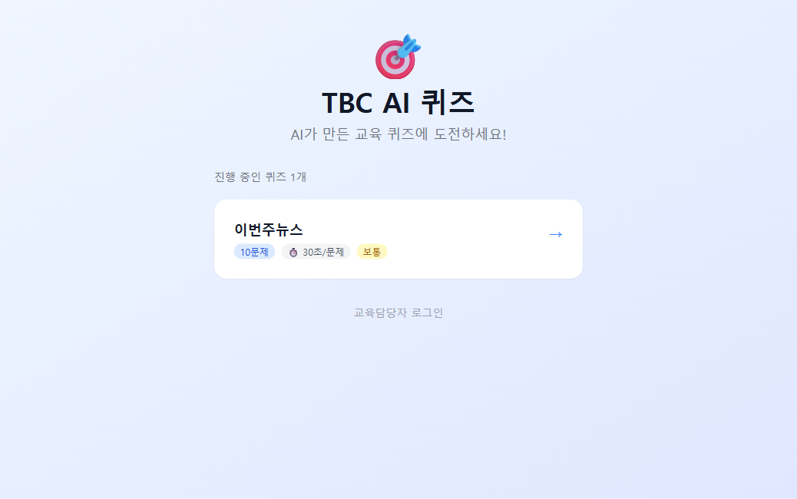
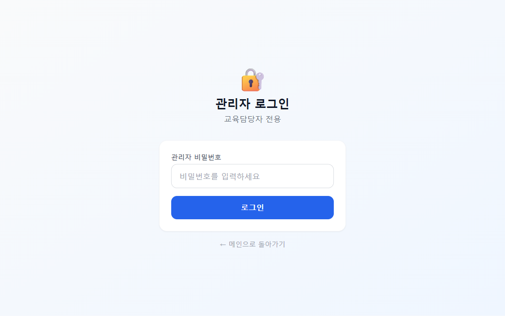
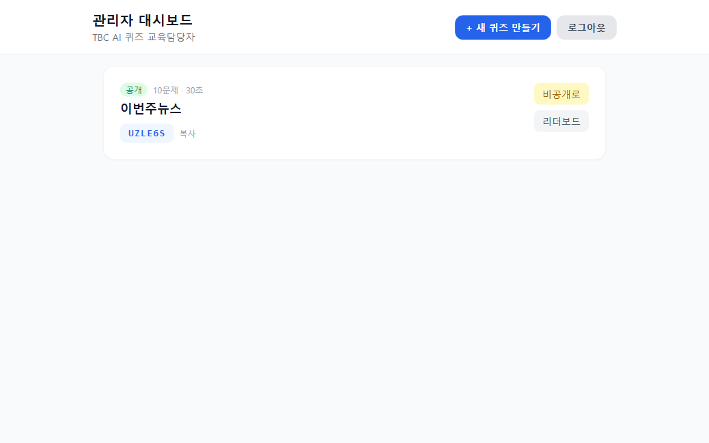
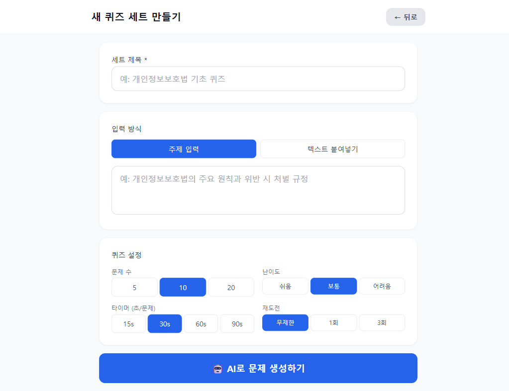

# 🎯 TBC AI 퀴즈

> AI가 자동으로 문제를 생성하는 사내 교육 퀴즈 프로그램 (MVP v1.0)

---

## 화면 미리보기

### 임직원 — 퀴즈 목록 화면


### 관리자 로그인


### 관리자 대시보드


### AI 퀴즈 생성


---

## 주요 기능

| 기능 | 설명 |
|------|------|
| 🤖 AI 문제 생성 | 주제나 텍스트를 입력하면 GPT-4o가 자동으로 문제 생성 |
| ⏱ 타이머 퀴즈 | 문제당 카운트다운 타이머 (색상 변화 + 진동 효과) |
| 🏆 실시간 리더보드 | Firebase 기반 점수 실시간 반영 |
| 📋 문제 검토·편집 | 생성된 문제를 저장 전 수정 가능 |
| 🔐 관리자 인증 | 비밀번호 기반 관리자 접근 제어 |

---

## 시작하기

### 1단계 — 의존성 설치 및 개발 서버 실행

```bash
npm install
npm run dev
# → http://localhost:5173 에서 확인
```

### 2단계 — Firebase 콘솔에서 Firestore 보안 규칙 적용

[Firebase 콘솔 → Firestore → 규칙](https://console.firebase.google.com/project/tbcai111/firestore/rules) 에서 아래 내용을 붙여넣고 저장:

```javascript
rules_version = '2';
service cloud.firestore {
  match /databases/{database}/documents {
    match /quizSets/{setId} {
      allow read: if true;
      allow create, update: if true;
      allow delete: if false;
    }
    match /quizSets/{setId}/questions/{questionId} {
      allow read: if true;
      allow create, update: if true;
      allow delete: if false;
    }
    match /quizSets/{setId}/submissions/{submissionId} {
      allow read: if true;
      allow create: if true;
      allow update, delete: if false;
    }
    match /leaderboards/{setId} {
      allow read: if true;
      allow write: if true;
    }
  }
}
```

### 3단계 — 빌드 및 배포 (선택)

```bash
npm run build
npx firebase-tools deploy --only hosting
```

---

## 화면 구조

| 경로 | 화면 | 대상 |
|------|------|------|
| `/` | 퀴즈 목록 (코드 없이 바로 선택) | 임직원 |
| `/admin/login` | 관리자 로그인 | 교육담당자 |
| `/admin/dashboard` | 퀴즈 세트 관리 | 교육담당자 |
| `/admin/create` | AI 퀴즈 생성 | 교육담당자 |
| `/nickname` | 닉네임 입력 | 임직원 |
| `/play` | 퀴즈 진행 (타이머 포함) | 임직원 |
| `/result` | 결과 확인 및 해설 | 임직원 |
| `/leaderboard/:setId` | 실시간 리더보드 | 공통 |

---

## 사용 방법

### 교육담당자

1. `/admin/login` 접속 → 관리자 비밀번호 입력
2. `+ 새 퀴즈 만들기` 클릭
3. 세트 제목 입력 → 주제 또는 학습 텍스트 입력
4. 문제 수 / 난이도 / 타이머 설정
5. `AI로 문제 생성하기` → 검토 후 `공개 저장`
6. 임직원에게 URL 공유

### 임직원

1. 메인 화면에서 퀴즈 선택
2. 닉네임 (+ 선택: 부서) 입력
3. 타이머 안에 문제 풀기
4. 결과 확인 및 리더보드에서 순위 확인

---

## 환경 변수 (`.env`)

> `.env.example` 파일을 복사해 `.env`로 만들고 값을 채우세요.

| 변수 | 설명 |
|------|------|
| `VITE_FIREBASE_API_KEY` | Firebase API 키 |
| `VITE_FIREBASE_AUTH_DOMAIN` | Firebase 인증 도메인 |
| `VITE_FIREBASE_PROJECT_ID` | Firebase 프로젝트 ID |
| `VITE_FIREBASE_STORAGE_BUCKET` | Storage 버킷 |
| `VITE_FIREBASE_MESSAGING_SENDER_ID` | 메시지 발신자 ID |
| `VITE_FIREBASE_APP_ID` | Firebase 앱 ID |
| `VITE_ADMIN_PASSWORD` | 관리자 비밀번호 |
| `VITE_OPENAI_API_KEY` | OpenAI API 키 (MVP: 클라이언트 직접 호출) |

> ⚠️ **보안 주의**: 현재 MVP는 사내망(VPN) 환경에서만 운영 권장. Phase 2에서 Firebase Auth 도입 후 서버 측 OpenAI 호출로 전환 예정.

---

## 기술 스택

| 분류 | 기술 |
|------|------|
| 프레임워크 | React 18 + TypeScript |
| 스타일링 | Tailwind CSS |
| 상태 관리 | Zustand |
| 라우팅 | React Router v6 |
| 데이터베이스 | Firebase Firestore |
| AI | OpenAI GPT-4o |
| 빌드 도구 | Vite |
